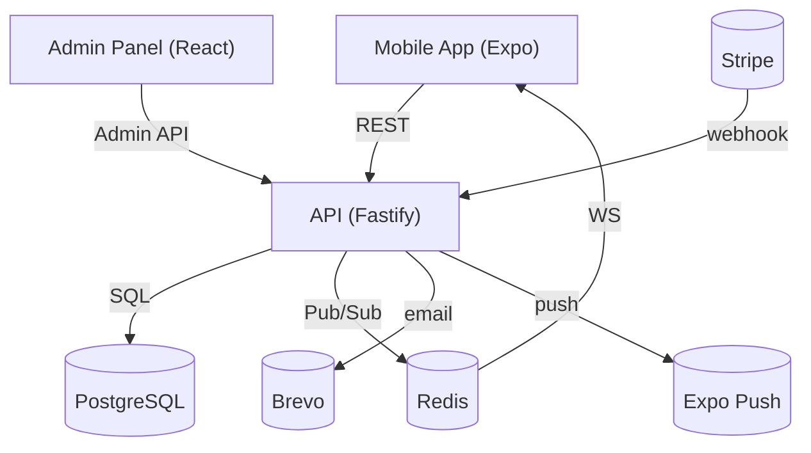

# GiveBlack — App Concept & Full Idea

## Vision

GiveBlack is a platform that makes it simple for individuals and organizations to support Black-led education and community programs. It combines a polished React Native mobile app for donors with a powerful React admin panel and a custom Node.js backend — enabling donations, volunteer signups, campaign management, direct payouts to charities, and robust admin workflows.

## Primary Users
- Donors: Individuals who browse campaigns, donate, save favorites, and volunteer.
- Charities: Organizations that submit campaigns, manage fundraising, and receive payouts.
- Admins: Platform operators who moderate content, approve charities, and manage payouts.

## Key Features

### 1) Authentication & Profiles
- Donor signup/login, charity signup (approval workflow), and guest mode.
- JWT-based sessions with short-lived access tokens + refresh tokens.
- Profile pages for donors and charities (contact, bank details, documents).

### 2) Campaign Discovery & Search
- Browse campaigns by category, featured, newest, and most funded.
- Full-text search and category filters; infinite scroll and pagination.
- Campaign cards show progress, donor count, and quick actions.

### 3) Campaign Page
- Cover image, description, goal & raised totals, progress bar.
- Donate (Stripe PaymentIntent), preset and custom amounts.
- Share (native + web), volunteer signup, campaign updates & gallery.

### 4) Donations & Payments
- Stripe integration for one-time donations and Stripe Connect for charity payouts.
- Server-side PaymentIntents, webhooks to record payments and update status.
- Fee handling, receipts via Brevo email, and donation splits.

### 5) Admin Panel / Dashboard
- Manage organizations, campaigns, categories, donations, volunteers.
- Approve charity signup requests, review documents, and onboard to Stripe Connect.
- Reports, exports, and ledger entries for reconciliation.
- Admin compatibility layer to simplify migration from Supabase.

### 6) Notifications
- Transactional emails via Brevo (Sendinblue).
- Push notifications via Expo (device tokens stored server-side).

### 7) Realtime & Sync
- WebSocket gateway (Fastify + Redis pub/sub) for campaign updates and admin alerts.
- Polling fallback for clients without socket support.

### 8) Media & Storage
- Migrate images from Supabase storage into local `/uploads` or external S3-compatible storage.
- Public URLs served via Nginx (or CDN).

### 9) Data Migration
- Scripts to migrate Supabase tables (organizations, campaigns, images, donations).
- Preserve IDs where possible; mirror images and update URLs.

### 10) Security & Reliability
- Parameterized SQL queries to prevent injection.
- Bcrypt password hashing, RBAC checks for admin routes.
- Rate limiting, CORS, and secure environment management.
- Backups & restore scripts for PostgreSQL.

## Architecture

- Mobile (Expo) -> Backend REST/API (Fastify) -> Postgres
- Admin Panel (React, Vite) -> Admin-compat endpoints -> Postgres
- WebSocket gateway for realtime updates (connected to Redis)
- Stripe webhooks -> Worker/endpoint -> Database & notifications

Mermaid flow (logical):

## Deployment & Dev Workflow

- Docker for API and worker processes; PM2 for Node process control if not using containers.
- Nginx reverse proxy with SSL for domain routing: `giveblackapp.com` (app/API) and `giveblackapp.com` (admin).
- CI pipeline: build admin, run tests, run migration scripts on staging, then deploy to production.
- Replit / GitHub integration: develop on Replit push to GitHub, run CI, then pull/merge on VPS.

## Operational Considerations

- Environment variables managed on the server (never committed).
- Database migrations and seed scripts versioned in repo.
- Backups scheduled nightly; retention policy.
- Monitoring: PM2 + log aggregation, uptime checks, and alerting for failed webhooks.

## Roadmap (next 6 months)

1. Improve analytics & donor dashboards.
2. Recurring donations & saved payment methods.
3. Internationalization (multi-currency support).
4. Advanced admin reports and exports.
5. Integrate a CDN for media assets and optimize image delivery.

## Contact & Contribution

Developers can contribute via PRs to the GitHub repository. Follow the code style and testing guidelines included in the repo.

